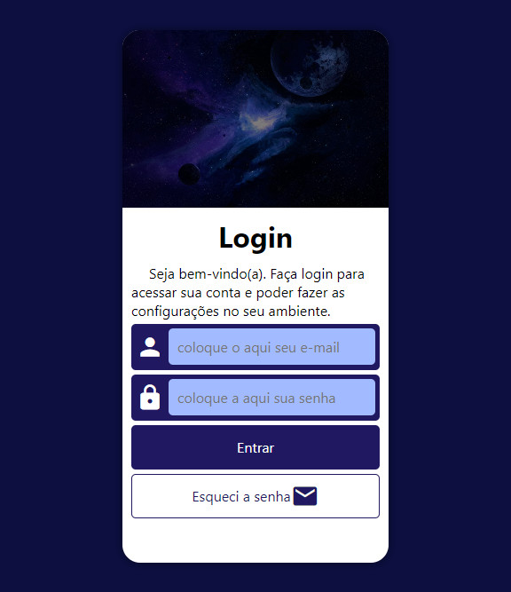
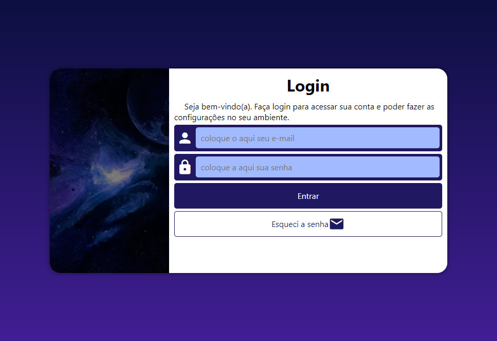
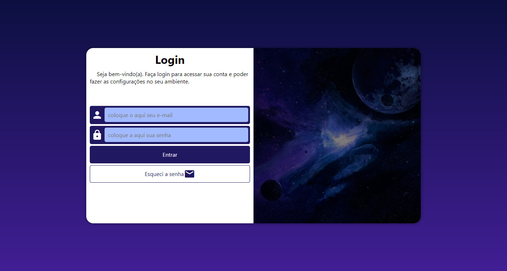

# CursoemVideo - Desafio tela de login

Essa é a minha versão do projeto login referente ao capítulo 26, módulo 4 do [CursoemVideo](https://www.youtube.com/watch?v=Ejkb_YpuHWs&list=PLHz_AreHm4dkZ9-atkcmcBaMZdmLHft8n).

    

## Proposta do desafio:

Aplicar o conceito **mobile first** para uma melhor otimização e responsividade da página, assim como o uso de **formulários** e **media queries** para a criação de uma tela de login reponsiva.